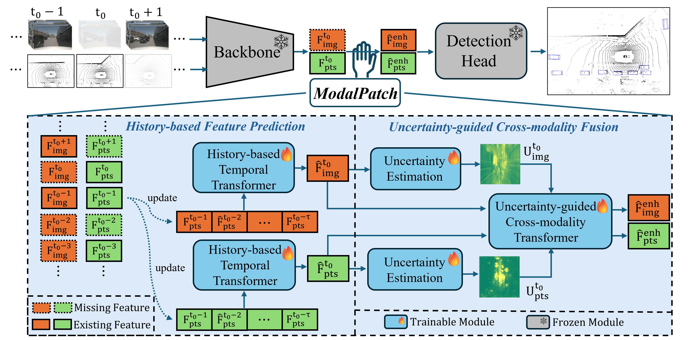

# ModalPatch: A Plug-and-Play Module for Robust Multi-Modal 3D Object Detection under Modality Drop [ICRA 2026]

---

## 📢 News
* **[202X-01-31]**: ModalPatch has been accepted by **ICRA 2026**! 🎉
* **[202X-02-27]**: Initial code release for integrating ModalPatch with UniBEV.


---

## 🌟 Introduction
**ModalPatch** is the first **plug-and-play** module specifically designed to tackle the **Modality Drop** problem in multi-modal 3D object detection. 
pip install -v -e .  # or "python setup.py develop"
In real-world autonomous driving, sensors (LiDAR or Cameras) often encounter transient data interruptions due to hardware glitches, adverse weather, or occlusions. ModalPatch enables robust detection under arbitrary modality-drop scenarios through:
- **Seamless Integration**: Can be plugged into diverse SOTA frameworks without architectural changes or re-training.
- **Perceptual Continuity**: Utilizes temporal sensor data to predict and "patch" missing features using a history-based mechanism.
- **Uncertainty-Aware Fusion**: Dynamically estimates the reliability of compensated features to suppress biased signals and reinforce informative ones.

---

## 🛠️ Installation and Dataset Preparation

👉 **[📄 Click here for Installation Guide](docs/INSTALL.md)**

👉 **[📄 Click here for Dataset Preparation Guide](docs/DATASET_PREPARATION.md)**

## 🧠 Method Overview

ModalPatch consists of two core components designed to "patch" missing sensor features using temporal information:

<div align="center">
  
  <br>
  <em>Figure: ModalPatch Framework</em>
</div>

- **History-based Feature Prediction (HFP)**: Predicts current features from a historical bank when a modality is dropped, ensuring continuous perception.
- **Uncertainty-guided Cross-modality Fusion (UCF)**: Estimates the reliability of predicted features and dynamically adjusts fusion weights to suppress noise.

## Training and Testing
We provide scripts for both training and evaluation

### HFP training
```bash
python tools/train_UniBEV.py projects/UniBEV/configs/unibev/unibev_featpred_nus_LC_cnw_256_modality_dropout.py
```

### + UCF training
```bash
python tools/train_UniBEV.py projects/UniBEV/configs/unibev/unibev_featpred-CrMdFusionUncert_nus_LC_cnw_256_modality_dropout.py 

```

### HFP+UCF testing
```bash
python tools/test_UniBEV.py projects/UniBEV/configs/unibev/inference/test_input_drop/unibev_hfp-CrMdFusionUncert.py remote_checkpoints/xxx.pth --eval bbox
```

### Model Zoo: 
Regarding model weights, you can find them in [`pretrained models`](https://drive.google.com/drive/folders/1S-AN7PK3b3Eds0F6ZFVxQQIBtNummrPI?usp=sharing) and easily reproduce the performance in the paper.

&ensp;
## Acknowledge
* Our code is based on [MMDetection3D](https://github.com/open-mmlab/mmdetection3d) and [UniBEV](https://github.com/tudelft-iv/UniBEV). Thanks for their awesome codebases.

## Citation
If you find this project useful in your research, please consider citing:
```

```